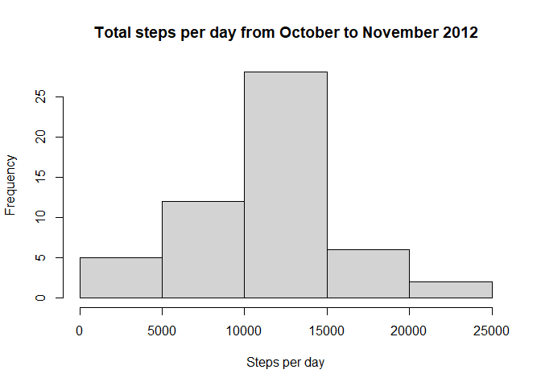
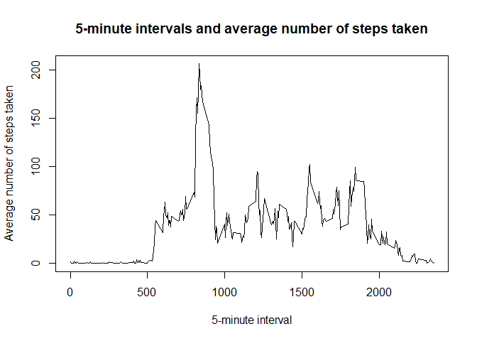
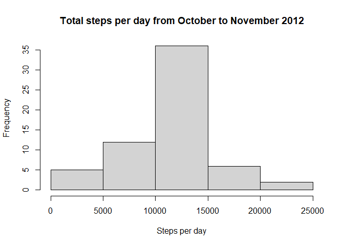

## Loading and preprocessing the data

```r
# Loading in the data
activity <- read.csv("activity.csv", header = TRUE, col.names = c("steps", 
        "date", "interval"), na.strings = "NA")

# Formatting dates variable from a factor to date
activity$date <- as.Date(as.character.Date(activity$date))

head(activity)
```

```
##   steps       date interval
## 1    NA 2012-10-01        0
## 2    NA 2012-10-01        5
## 3    NA 2012-10-01       10
## 4    NA 2012-10-01       15
## 5    NA 2012-10-01       20
## 6    NA 2012-10-01       25
```

## What is mean total number of steps taken per day?

1. Calculate the total number of steps taken per day.


```r
totalsteps <- aggregate(steps ~ date, data = activity, sum, na.rm = TRUE)
```


2. Make a histogram of the total number of steps taken each day.


```r
hist(totalsteps$steps, xlab = "Steps per day", ylab = "Frequency", main = "Total steps per day from October to November 2012")
```

<!-- -->


3. Calculate and report the mean and median of the total number of steps taken per day.


```r
mean(totalsteps$steps)
```

```
## [1] 10766.19
```

```r
median(totalsteps$steps)
```

```
## [1] 10765
```

**The mean number of steps taken per day is 10,766.19. The median number of steps taken per day is 10,765.**


## What is the average daily activity pattern?

1. Make a time series plot (i.e. type = "l") of the 5-minute interval (x-axis) and the average number of steps taken, averaged across all days (y-axis).


```r
library(dplyr)

# Grouping data by intervals then summarizing by the mean, excluding NAs
actpattern <- group_by(activity, interval) %>% summarize(mean = mean(steps, na.rm = TRUE))
```

```
## `summarise()` ungrouping output (override with `.groups` argument)
```

```r
plot(actpattern$interval, actpattern$mean, type = "l", xlab = "5-minute interval", ylab = "Average number of steps taken", main = "5-minute intervals and average number of steps taken")
```

<!-- -->


2. Which 5-minute interval, on average across all the days in the dataset, contains the maximum number of steps?


```r
actpattern[which.max(actpattern$mean), 1]
```

```
## # A tibble: 1 x 1
##   interval
##      <int>
## 1      835
```

**The 835th interval contains the maximum number of steps on average across all the days in the dataset.**


## Imputing missing values

1. Calculate and report the total number of missing values in the dataset (i.e. the total number of rows with NAs).


```r
# Calculating the number of rows where there is a NA in either column of the dataset
sum(is.na(activity$steps) | is.na(activity$date) | is.na(activity$interval))
```

```
## [1] 2304
```
**The total number of missing values in the dataset is 2,304.**

2. Devise a strategy for filling in all of the missing values in the dataset. The strategy does not need to be sophisticated. For example, you could use the mean/median for that day, or the mean for that 5-minute interval, etc.


**Strategy will be taking the mean for that 5-minutes interval.**


3. Create a new dataset that is equal to the original dataset but with the missing data filled in.


```r
# Creating a new dataset
newactivity <- activity

# If there is a na in the steps column, it will then be replaced with the corresponding value from the totalsteps data frame above

for (i in 1:nrow(activity)) {
        if (is.na(activity[i, 1])) {
                newactivity[i, 1] = actpattern[actpattern$interval == activity[i, 3], 2]
        }
}

for (i in 1:nrow(activity)) {
  if (is.na(activity[i, 1])) {
    newactivity[i, 1] = actpattern[actpattern$interval == activity[i, 3], 2]
  }
}
```


4. Make a histogram of the total number of steps taken each day and Calculate and report the mean and median total number of steps taken per day. Do these values differ from the estimates from the first part of the assignment? What is the impact of imputing missing data on the estimates of the total daily number of steps?


```r
totalsteps2 <- tapply(newactivity$steps, newactivity$date, FUN = sum)
hist(totalsteps2, xlab = "Steps per day", ylab = "Frequency", main = "Total steps per day from October to November 2012")
```

<!-- -->

```r
mean(totalsteps2)
```

```
## [1] 10766.19
```

```r
median(totalsteps2)
```

```
## [1] 10766.19
```

**The mean and median number of steps taken per day is 10,766.19. These values differ from those in the first part of the assignment. The impact of imputing missing data on the estimates of the total daily number of steps is small.**


## Are there differences in activity patterns between weekdays and weekends?


1. Create a new factor variable in the dataset with two levels – “weekday” and “weekend” indicating whether a given date is a weekday or weekend day.


```r
newactivity$day <- weekdays(as.Date(newactivity$date))
newactivity$day[newactivity$day == "Sunday"] <- "Weekend"
newactivity$day[newactivity$day == "Monday"] <- "Weekday"
newactivity$day[newactivity$day == "Tuesday"] <- "Weekday"
newactivity$day[newactivity$day == "Wednesday"] <- "Weekday"
newactivity$day[newactivity$day == "Thursday"] <- "Weekday"
newactivity$day[newactivity$day == "Friday"] <- "Weekday"
newactivity$day[newactivity$day == "Saturday"] <- "Weekend"
newactivity$day <- as.factor(newactivity$day)

head(newactivity)
```

```
##       steps       date interval     day
## 1 1.7169811 2012-10-01        0 Weekday
## 2 0.3396226 2012-10-01        5 Weekday
## 3 0.1320755 2012-10-01       10 Weekday
## 4 0.1509434 2012-10-01       15 Weekday
## 5 0.0754717 2012-10-01       20 Weekday
## 6 2.0943396 2012-10-01       25 Weekday
```


2. Make a panel plot containing a time series plot (i.e. type = "l") of the 5-minute interval (x-axis) and the average number of steps taken, averaged across all weekday days or weekend days (y-axis). See the README file in the GitHub repository to see an example of what this plot should look like using simulated data.


```r
library(lattice)
meansteps_byday <- aggregate(steps ~ interval + day, newactivity, FUN = mean)
xyplot(steps ~ interval | day, meansteps_byday, layout = c(1,2), type = "l")
```

<!-- -->

**There are differences in activity patterns between weekdays and weekends.**
